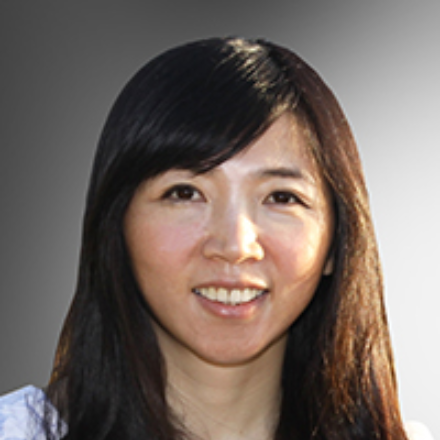

# Thursday, February 2nd, 2023

## <a id="jv">Jeffrey Vetter - _Keynote_ - Deep Codesign in the Post-Exascale Computing Era</a>

**Abstract:** DOE has just deployed its first Exascale system at ORNL, so now is an appropriate time to revisit our Exascale predictions from over a decade ago and think about post-Exascale. We are now seeing a Cambrian explosion of new technologies during this this ‘golden age of architectures,’ making codesign of architectures with software and applications more critical than ever. In this talk, I will revisit Exascale trajectory, survey post-Exascale technologies, and discuss their implications for both system design and software. As an example, I will describe Abisko, a new microelectronics codesign project, that focuses on designing a chiplet for analog spiking neural networks using novel neuromorphic materials.

**Biography:**
Jeffrey Vetter, Ph.D., is a Corporate Fellow at Oak Ridge National Laboratory (ORNL). At ORNL, he is currently the Section Head for Advanced Computer Systems Research and the founding director of the Experimental Computing Laboratory (ExCL). Vetter earned his Ph.D. in Computer Science from the Georgia Institute of Technology. Vetter is a Fellow of the IEEE and AAAS, and a Distinguished Scientist Member of the ACM. In 2010, Vetter, as part of an interdisciplinary team from Georgia Tech, NYU, and ORNL, was awarded the ACM Gordon Bell Prize. In 2020, in collaboration with a large team from IBM and LLNL, Vetter was awarded the SC20 Test of Time award for the paper from SC02, entitled “An Overview of the Blue Gene/L Supercomputer.” In 2015, Vetter served as the SC15 Technical Program Chair. His recent books, entitled "Contemporary High Performance Computing: From Petascale toward Exascale (Vols. 1-3)," survey the international landscape of HPC. Learn more information at https://vetter.github.io/.

<!-- ritesh jain section -->

## <a id="jv">Ritesh Jain - Accelerating AI through photonic communication and computing </a>

<!-- suman datta section -->
## <a id="jv">Suman Datta - TBD Title</a>

<!-- Vivesh S. Sathe section -->

## <a id="jv">Vivesh S. Sathe - Extending Dennard Scaling for HPC through CryoCMOS device-circuit co-design </a>

<!-- Bill Harrod -->
## <a id="jv">Bill Harrod - TBD Title</a>

<!-- Fabrizio Petrini -->
## <a id="jv">Fabrizio Petrini - TBD Title</a>

<!-- Vivek Sarkar -->
## <a id="jv">Vivek Sarkar - TBD Title</a>

<!-- Samantika Sury -->
## <a id="jv">Samantika Sury - Memory Coupled Compute: Innovating the Future of HPC and AI </a>

<!-- Jeff Hollingsworth -->
## <a id="jv">Jeff Hollingsworth - Clustering Quantum Computers using Quantum Networks </a>

<!-- Creston Harold -->
## <a id="jv">Creston Harold - TBD Title</a>

# Friday, February 3rd, 2023

<!-- James Hoe -->
## <a id="jv">James Hoe - FPGA Technology at Crossroads </a>

<!-- Siva Rajamanickam -->
## <a id="jv">Siva Rajamanickam - TBD Title</a>

<!-- Callie Hao -->
## <a id="jv">Callie Hao - Multi-task Vision Transformer with Mixture-of-Expert: Algorithm and Accelerator</a>

<!-- Celine Lin -->
## <a id="jv">Celine Lin - Towards Network-Accelerator Co-Search for Promoting Ubiquitous on-Device Intelligence and Green AI</a>

<!-- Seung-Jong Park -->
## <a id="jv">Seung-Jong Park - NSF CISE/OAC Programs: Software and Data Cyberinfrastructures for Large Scale Science and
Technologies</a>

<!-- Catherine (Katie) Schuman, -->
## <a id="jv">Catherine (Katie) Schuman - Application-Hardware Co-Design for Neuromorphic Systems </a>

<!-- Nabil Imam -->
## <a id="jv">Nabil Imam - TBD Title</a>

<!-- Jennifer Hasler -->
## <a id="jv">Jennifer Hasler - TBD Title</a>

