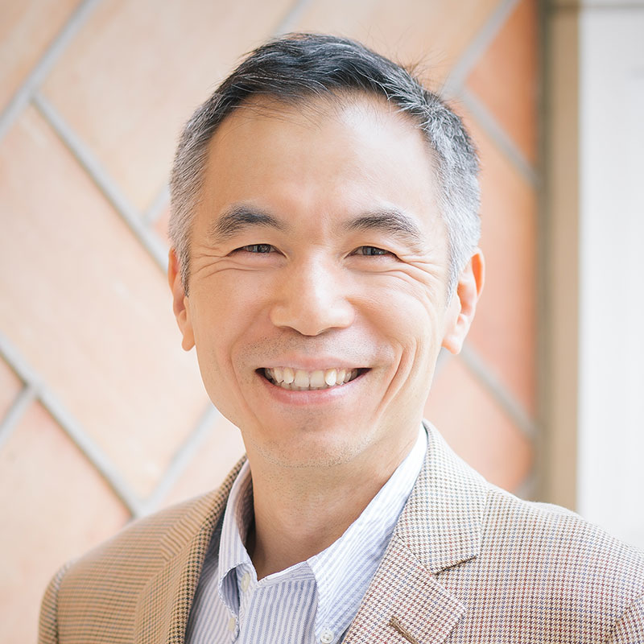

# Thursday, February 2nd, 2023

## <a id="jv">Jeffrey Vetter - _Keynote_ - Deep Codesign in the Post-Exascale Computing Era</a>

**Abstract:** DOE has just deployed its first Exascale system at ORNL, so now is an appropriate time to revisit our Exascale predictions from over a decade ago and think about post-Exascale. We are now seeing a Cambrian explosion of new technologies during this this ‘golden age of architectures,’ making codesign of architectures with software and applications more critical than ever. In this talk, I will revisit Exascale trajectory, survey post-Exascale technologies, and discuss their implications for both system design and software. As an example, I will describe Abisko, a new microelectronics codesign project, that focuses on designing a chiplet for analog spiking neural networks using novel neuromorphic materials.

**Biography:**
Jeffrey Vetter, Ph.D., is a Corporate Fellow at Oak Ridge National Laboratory (ORNL). At ORNL, he is currently the Section Head for Advanced Computer Systems Research and the founding director of the Experimental Computing Laboratory (ExCL). Vetter earned his Ph.D. in Computer Science from the Georgia Institute of Technology. Vetter is a Fellow of the IEEE and AAAS, and a Distinguished Scientist Member of the ACM. In 2010, Vetter, as part of an interdisciplinary team from Georgia Tech, NYU, and ORNL, was awarded the ACM Gordon Bell Prize. In 2020, in collaboration with a large team from IBM and LLNL, Vetter was awarded the SC20 Test of Time award for the paper from SC02, entitled “An Overview of the Blue Gene/L Supercomputer.” In 2015, Vetter served as the SC15 Technical Program Chair. His recent books, entitled "Contemporary High Performance Computing: From Petascale toward Exascale (Vols. 1-3)," survey the international landscape of HPC. Learn more information at https://vetter.github.io/.

<!-- ritesh jain section -->

## <a id="jv">Ritesh Jain - Accelerating AI through photonic communication and computing </a>

**Abstract:** The insatiable growth in computing needs, coupled with the end of Dennard Scaling and the slowdown of Moore’s Law, is resulting in a major shift across the industry towards a chiplets-based product architecture. Solutions that enable the heterogeneous integration of disaggregated silicon at high data rates and low power are becoming increasingly important. Silicon photonics based interconnect solutions play a critical role in enabling this integration.

**Biography:**
Ritesh Jain is Vice President of Hardware Engineering at Lightmatter, focusing on Systems and Packaging. He leads the team responsible for developing systems solutions for Lightmatter's Envise and Passage products. Before joining Lightmatter, Ritesh was a Vice President of HW Engineering at Intel's Data Center and AI Group where he spent over 2 decades developing HW solutions for data center products including Intel's Xeon CPUs and AI accelerators. Ritesh earned a Bachelor’s degree in Mechanical Engineering from the Indian Institute of Technology, Madras, India; and a Master’s degree in electronic packaging from the University of Maryland, College Park. 

<!-- suman datta section -->
## <a id="sd">Suman Datta - Cool CMOS as Performance Booster  </a>

**Abstract:** Energy efficient scaling of CMOS while delivering on performance in the era of hyperscaling remains a challenge. CMOS logic transistor performance needs to be balanced with high capacity, high bandwidth memory. Cool CMOS – that is CMOS operating at liquid nitrogen temperatures (77K) – may provide a path toward scaling devices and providing performance boost. Improved mobility, steeper switching slope, lower interconnect resistance at low temperature – can enable aggressive supply voltage scaling. Taking into account the energy cost of cooling, it is feasible to demonstrate a net energy-delay product (EDP) benefit. In this talk, we will cover our ongoing effort in designing and quantifying the performance of Cool-FinFET, Cool-SRAM and novel memory such as Cool-floating body DRAM.  A combination of all these technologies can provide a superior core-to-cache balance, reduced power consummation and faster compute throughput. 

**Biography:**
Suman Datta is the Joseph M Pettit Chair of Advanced Computing and Georgia Research Alliance (GRA) Eminent Scholar and Professor in the School of Electrical & Computer Engineering at Georgia Tech. He received his B.Tech degree in Electrical Engineering from the Indian Institute of Technology, Kanpur, India, and his Ph.D. degree in Electrical and Computer Engineering from the University of Cincinnati, Ohio, USA. His research group focuses on novel semiconductor devices that enhance existing or enable new compute models. He has published over 425 journal and refereed conference papers and holds more than 187 issued patents related to semiconductor devices. He is a Fellow of IEEE and NAI. 

<!-- Vivesh S. Sathe section -->

## <a id="vs">Vivesh S. Sathe - Extending Dennard Scaling for HPC through CryoCMOS device-circuit co-design </a>

**Abstract:** The formidable rate of improvement in computing performance up till the past decade has been a driving force in driving broader technological advances. The end of Dennard Scaling over the past decade has engendered serious efforts across all layers of system abstraction – devices, circuits, architectures and algorithms – to sustain growth in computing performance. Meanwhile, for several decades now, computing at cryogenic temperatures (cryoCMOS) has attracted interest among researchers looking to push performance past conventional limits. High Performance Computing (HPC), which seek to maximize operations-per-watt (ops/W) can potentially benefit greatly from a more comprehensive approach to cryoCMOS computing.

In this talk, we begin by discussing some of the costs, challenges and opportunities for computing at cryogenic temperatures. We then examine some promising circuit techniques suited to cryoCMOS operation to deliver up to 4x improvement in perf./W over conventional CMOS techniques (accounting of cooling power). These efforts into cryo-CMOS device-circuit optimization are expected to provide a foundation upon which additional architectural and system level efficiencies can be extracted.

**Biography:**
Visvesh is currently at the Georgia Institute of Technology where his group, the Processing Systems lab, works on a range of problems spanning energy efficient computing, integrated power electronics, and mixed-signal design. Prior to joining UW, he spent six years at AMD where he invented and translated a number of key technologies for energy efficient computing into volume production. These included the resonant clocking in AMDs "Piledriver" and "Steamroller" microprocessors, and adaptive clock stretching for voltage droop mitigation. He currently serves on the IEEE SSCS webinar committee to promote professional and student development, and is a distinguished lecturer of the IEEE Solid State Circuits Society, and in the Technical Program Committee of the Custom Integrated Circuits Conference and the International Solid-State Circuits Conference. 

<!-- Bill Harrod -->
## <a id="bh">Bill Harrod - IARPA AGILE Program</a>

**Abstract:** Today’s era of explosive data growth poses serious challenges for society in transforming massive, random, heterogeneous data streams and structures into useful knowledge, a necessity in every aspect of modern life, including national security, economic productivity, scientific discovery, medical breakthroughs, and social interactions. This burgeoning data, which is increasing exponentially not only in volume, but in velocity, variety, and complexity, already far outpaces the abilities of current computing systems to execute the complex data analytics needed to extract meaningful insights in a timely manner.

The key problem with today’s computers is that they were designed to address yesterday’s compute-intensive problems rather than today’s data-intensive problems. Developing data centric computing systems requires a complete rethinking of computing architectures and technologies. The computations to be performed are determined by the data, and multiple applications might need simultaneous access to the same data. These are very different conditions than those characteristic of yesterday’s compute-intensive applications. 

IARPA’s new AGILE Program aims to provide data-analytic results in time for appropriate response, e.g., to predict impending adversarial events rather than forensically analyzing them after the fact.  It will accomplish this goal by developing new system-level intelligent mechanisms for moving, accessing, and storing large, random, time-varying data streams and structures that allow for the scalable and efficient execution of dynamic graph analytic applications. This talk will provide a selection of the technical approaches that are being developed by the AGILE Performers.

**Biography:**
Dr. Bill Harrod is a program manager at the U.S.’s Intelligence Advanced Research Projects Activity (IARPA). His technical focus areas include strategic computing, trusted microelectronics, nanoscale image reconstruction, and algorithms.  He developed IARPA’s AGILE program, which aims to revolutionize computer architectures for strategically essential data challenges.  The architectures being developed are driven by data-intensive graph analytics and artificial intelligence algorithms.  

Prior to joining IARPA, Dr. Harrod worked at the Department of Energy from 2011 to 2018, where he served as the Director of the Research Division in the Advanced Scientific Computing Research (ASCR) Office.  From 2005 to 2010, Dr. Harrod was a Program Manager at the Defense Advanced Research Projects Agency (DARPA).  At DARPA, Dr. Harrod led a series of groundbreaking exascale computing studies, which involved leading experts in industry and academia in investigating architectures, system software, resiliency, and applications.  These pioneering studies led to a detailed projection of the technical challenges needed to advance supercomputing from the petascale to the exascale level. 

His earlier positions included Section Leader of the Math Software Group at Cray Research and Silicon Graphics, Inc and researcher at the University of Illinois. 

Dr Harrod earned a Ph.D. in mathematics from the University of Tennessee and a bachelor's degree in mathematics from Emory University. 

<!-- Fabrizio Petrini -->
## <a id="fp">Fabrizio Petrini - Optimal Diameter-2 and Diamter-3 Network Topologies for Large-scale Data Centers   </a>

**Abstract:**  In this talk we present PolarFly, a family of diameter-2 network topologies based on polarity graphs from finite geometry, and PolarStar, a family of diameter-3 network topologies derived from the star product of two low-diameter factor graphs.  
PolarFly is the first known diameter-2 topology that asymptotically reaches the Moore bound on the number of nodes for a given network degree and diameter. PolarFly achieves high Moore bound efficiency even for the moderate radixes commonly seen in current and near-future routers, reaching more than 96% of the theoretical peak. It also offers more feasible router degrees than the state-of-the-art solutions, greatly adding to the selection of scalable diameter 2 networks. 
PolarStar provides the largest known diameter-3 network topologies for almost all radixes. When compared to state-of-the-art diameter-3 networks, PolarStar achieves 31% geometric mean increase in scale over Bundlefly, 91% over Dragonfly, and 690% over HyperX. 

**Biography:**
Fabrizio Petrini is a Senior Principal Engineer of the Intel Parallel Computing Labs in Santa Clara, CA. His research interests include data-intensive algorithms for graph analytics and sparse linear algebra, Exascale computing, high performance interconnection networks and novel architectures. He is the Principal investigator of the TCStream project, Co-Principal investigator of the Intel PIUMA architecture developed under the DARPA HIVE and SDH programs, and the upcoming Intel TIGRE system, as part of the IARPA AGILE program. 
Fabrizio published over 120 peer-reviewed journal and conference articles which received 6000 citations and is serving as associate editor for the IEEE Transactions on Computers and Transactions on Parallel and Distributed systems. He received a PhD in Computer Science from the University of Pisa, Italy, holding research positions at the Oxford University in the UK, Los Alamos and Pacific Northwest National Laboratories, and the IBM TJ Watson Center. 

<!-- Vivek Sarkar -->
## <a id="vsarkar">Vivek Sarkar - AGILE co-design for graph applications in the FORZA project </a>

<!-- **Abstract:** DOE has just deployed its first Exascale system at ORNL, so now is an appropriate time to revisit our Exascale predictions from over a decade ago and think about post-Exascale. We are now seeing a Cambrian explosion of new technologies during this this ‘golden age of architectures,’ making codesign of architectures with software and applications more critical than ever. In this talk, I will revisit Exascale trajectory, survey post-Exascale technologies, and discuss their implications for both system design and software. As an example, I will describe Abisko, a new microelectronics codesign project, that focuses on designing a chiplet for analog spiking neural networks using novel neuromorphic materials.

**Biography:**
Jeffrey Vetter, Ph.D., is a Corporate Fellow at Oak Ridge National Laboratory (ORNL). At ORNL, he is currently the Section Head for Advanced Computer Systems Research and the founding director of the Experimental Computing Laboratory (ExCL). Vetter earned his Ph.D. in Computer Science from the Georgia Institute of Technology. Vetter is a Fellow of the IEEE and AAAS, and a Distinguished Scientist Member of the ACM. In 2010, Vetter, as part of an interdisciplinary team from Georgia Tech, NYU, and ORNL, was awarded the ACM Gordon Bell Prize. In 2020, in collaboration with a large team from IBM and LLNL, Vetter was awarded the SC20 Test of Time award for the paper from SC02, entitled “An Overview of the Blue Gene/L Supercomputer.” In 2015, Vetter served as the SC15 Technical Program Chair. His recent books, entitled "Contemporary High Performance Computing: From Petascale toward Exascale (Vols. 1-3)," survey the international landscape of HPC. Learn more information at https://vetter.github.io/. -->

<!-- Samantika Sury -->
## <a id="sss">Samantika Sury - Memory Coupled Compute: Innovating the Future of HPC and AI </a>

**Abstract:** The talk will focus on the major challenges in achieving high memory and communication performance in HPC and AI applications and discuss some key technologies being developed at Samsung to address these challenges. 

**Biography:**
Samantika Sury is Chief Hardware Architect and VP for HPC Hardware for Samsung Electronics – SAIT Systems Architecture Lab. In this role she is responsible for architecting and leading Samsung’s HPC and AI system hardware architecture with a vision to address the memory and communication wall. She has over 15 years of experience leading HPC Pathfinding and System Architecture and has a PhD from Georgia Institute of Technology. 

<!-- Jeff Hollingsworth -->
## <a id="jh">Jeff Hollingsworth - Clustering Quantum Computers using Quantum Networks </a>

**Abstract:** For decades clustering together conventional computers has been used to achieve performance greater than possible on a single computer.  As we start to see commercial quantum computers become available, the desire to cluster them together for greater capacity is emerging.  In this talk I will discuss early work being done at the University of Maryland to cluster quantum computers.  I will report about our experience with our first commercial quantum from IonQ. I will also talk about the research going on to create MARQI a regional quantum network being developed to connect UMD, IonQ, and the Army Research Laboratory.

**Biography:**
Jeff Hollingsworth is Vice President of IT, Chief Information Officer, and a Professor of Computer Science at the University of Maryland.  His research focuses in the area of performance measurement for high performance computing. In his role as CIO he oversees MAX, UMD's regional high speed network, and QLab where UMD's Quantum computer is located.

<!-- Creston Herold -->
## <a id="ch">Creston Herold - Optimization with Near-term Quantum Computers</a>

**Abstract:** 

**Biography:**

# Friday, February 3rd, 2023

<!-- James Hoe -->
## <a id="jv">James Hoe - FPGA Technology at Crossroads </a>

**Abstract:** Field Programmable Gate Arrays (FPGAs) have been undergoing rapid and dramatic changes fueled by their expanding use in datacenter and machine learning. Rather than serving as a compromise or alternative to ASICs, modern FPGA 'programmable logic' is emerging as a third paradigm of compute that stands apart from traditional hardware vs. software archetypes. The Intel/VMware Crossroads 3D-FPGA Academic Research Center is a multi-university collaborative research to define a new role for programmable logic in future datacenter servers. Guided by both the demands of modern network-driven, data-centric computing and the new capabilities from 3D integration, this center is developing the Crossroads 3D-FPGA as a new central fixture component on future server motherboards, serving to connect all server endpoints (network, storage, memory, CPU) intelligently. As a literal crossroads of data, a Crossroads 3D-FPGA can apply application-specific functions over data-on-the-move between any pair of server endpoints, intelligently steer data to the right core or accelerator, and reduce the volume of data that needs to be moved between servers. This talk will overview the Crossroads 3-D FPGA concepts, as well as the associated set of research thrusts to pursue a full-stack solution spanning application, programming support, dynamic runtime, design automation, and architecture. 

**Biography:**
James C. Hoe is a Professor of Electrical and Computer Engineering at Carnegie Mellon University. He received his Ph.D. in EECS from Massachusetts Institute of Technology in 2000 (S.M., 1994). He received his B.S. in EECS from UC Berkeley in 1992. He is interested in many aspects of computer architecture and digital hardware design, including the specific areas of FPGA architecture for computing; digital signal processing hardware; and high-level hardware design and synthesis. He is the lead PI of the Intel/VMware Crossroads 3D-FPGA Academic Research Center. He is a Fellow of IEEE. For more information, please visit http://www.ece.cmu.edu/~jhoe. 

<!-- Siva Rajamanickam -->
## <a id="jv">Siva Rajamanickam - Recent Experiences on Accelerating ML workloads on SambaNova Systems </a>

**Abstract:** The adoption of machine learning for accelerating science simulations or for building models on experimental data sets has increased recently at Sandia. This has led to a need for training and inference resources that are customized for ML training. As part of exploring advanced architectures, we are evaluating data flow accelerators for machine learning workloads. Data flow accelerators offer a potential path to hold the ML model on the chip and stream the training data through the model. SambaNova Systems provide one such data flow accelerator based system that target acceleration of machine learning use cases. We use ML models from two use cases, a surrogate model for density functional theory and a GNN model for graph analysis, as examples and evaluate them on SambaNova hardware. I will present how we improved performance of these two use cases in collaboration with SambaNova. 

**Biography:**
Siva Rajamanickam is a principal member of technical staff at Sandia National Laboratories. His interest is broadly in the areas of high performance computing, specifically in performance portable algorithms, machine learning for science, co-design of algorithms and architectures and combinatorial scientific computing. Most of his works are in the intersection of these areas where interesting opportunities lie to solve problems that are of importance to computational science use cases.  Dr. Rajamanickam leads several projects funded by the Advanced Scientific Computing and Research (ASCR) program of DOE Office of Science, NNSA’s Advanced Simulation and Computing program and Sandia’s Lab Directed Research and Development program. Dr. Rajamanickam has been part of leadership for several open source, high performance scientific software. He is part of the leadership team for the Kokkos ecosystem and the linear solvers product area lead for the Trilinos library. His scientific machine learning contributions are part of the materials library MALA.  

<!-- Callie Hao -->
## <a id="jv">Callie Hao - Multi-task Vision Transformer with Mixture-of-Expert: Algorithm and Accelerator</a>

**Abstract:** Dr. Cong (Callie) Hao is an assistant professor in ECE at Georgia Tech. She was a postdoctoral fellow at Georgia Tech from 2020-2021 and at UIUC from 2018-2020. She received the Ph.D. degree in Electrical Engineering from Waseda University in 2017, and the M.S. and B.S. degrees in Computer Science and Engineering from Shanghai Jiao Tong University. Her primary research interests lie in the joint area of efficient hardware design and machine learning algorithms, including software/hardware co-design for reconfigurable and high-efficiency computing and agile electronic design automation tools. 

**Biography:**
The computer vision community is embracing two promising learning paradigms: the Vision Transformer (ViT) and Multi-task Learning (MTL). ViT models show extraordinary performance comparing with traditional convolution networks but are commonly recognized as computation-intensive. MTL uses one model to infer multiple tasks with better performance by enforcing shared representation among tasks, but a huge drawback is that, most MTL regimes require activation of the entire model even when only one or a few tasks are needed, causing significant computing waste. In this talk, first, we introduce a mixture-of-experts (MoE) approach for MTL ViT, where the experts are sparsely and dynamically activated based on the current task. The approach achieves better accuracy and a huge computation reduction. Second, , we propose Edge-MoE, the first end-to-end FPGA accelerator for multi-task ViT with a rich collection of architectural innovations. 

<!-- Celine Lin -->
## <a id="jv">Celine Lin - Towards Network-Accelerator Co-Search for Promoting Ubiquitous on-Device Intelligence and Green AI</a>

**Abstract:** Deep learning (DL)-powered intelligence embedded into numerous daily-life devices promises to transform the quality of human life. Despite this great promise, there is a vast and increasing gap between the prohibitive complexity of powerful DL algorithms and the constrained resources in daily-life devices. While DL accelerators have the potential to close the aforementioned immense gap and push forward green AI, their power has yet to be unleashed due to the following fundamental challenges: (1) fast DL algorithm advances vs. slow DL accelerator development, and (2) the promise of algorithm and accelerator co-search vs. the lack of such co-search. Therefore, it is imperative to develop innovative techniques that can expedite the development of optimal DL accelerators and unlock the promise of co-searching for optimal DL algorithms and accelerators for maximizing their achievable hardware efficiency.  

In this talk, I will present our recently developed techniques towards DL network-accelerator co-search, serving as a timely holistic effort toward addressing the aforementioned challenges. Specifically, I will start by introducing our techniques for designing hardware-aware DL algorithms (i.e., top-down efforts) and algorithm-aware DL accelerators (i.e., bottom-up efforts), which help us to gain important insights for understanding their design space and optimization. Then, I will share our first-of-their-kind techniques that are among the very first generic efforts to enable simultaneous searching for optimal DL algorithms and accelerators (i.e., bridging efforts) to maximize both task accuracy and hardware efficiency. Finally, I will conclude my talk with exciting (1) applications of our co-search framework and (2) pointers to future directions.   

**Biography:**
 Yingyan (Celine) Lin is currently an Associate Professor in the School of Computer Science at the Georgia Institute of Technology. She leads the Efficient and Intelligent Computing (EIC) Lab, which focuses on developing efficient machine learning systems via cross-layer innovations, from algorithm to architecture down to chip design, aiming to promote green AI and enable ubiquitous machine learning powered intelligence. She received a Ph.D. degree in Electrical and Computer Engineering from the University of Illinois at Urbana-Champaign in 2017.  

<!-- Seung-Jong Park -->
## <a id="jv">Seung-Jong Park - NSF CISE/OAC Programs: Software and Data Cyberinfrastructures for Large Scale Science and
Technologies</a>

**Abstract:** The Office of Advanced Cyberinfrastructure (OAC) of NSF supports and coordinates the development, acquisition, and provision of state-of-the-art cyberinfrastructure resources, tools, and services essential to the advancement and transformation of science and engineering through programs, such as Major Research Instrumentation (MRI), Advanced Computing Systems & Services (ACSS), Campus Cyberinfrastructure (CC*), Advanced Cyberinfrastructure Coordination Ecosystem: Services & Support (ACCESS), etc. 

OAC also supports forward-looking research and education to expand the future capabilities of cyberinfrastructure specific to science and engineering through programs, such as OAC Core program, Principles and Practice of Scalable Systems (PPoSS), Cyberinfrastructure for Sustained Scientific Innovation (CSSI), CyberTraining, Computational and Data-Enabled Science and Engineering (CDS&E), Cybersecurity Innovation for Cyberinfrastructure (CICI), Career, etc. 

The talk will cover those programs in detail. And there will be questions and answers session about them. 

**Biography:**
Dr. Seung-Jong Jay Park is the Dr. Fred H. Fenn Memorial Professor of Computer Science and Engineering at Louisiana State University where he has worked in cyberinfrastructure development for large-scale scientific and engineering applications since 2004. He received Ph.D. in the school of Electrical and Computer Engineering from the Georgia Institute of Technology (2004). He has performed interdisciplinary research projects including (1) big data & deep learning research including developing software frameworks for large-scale science applications and (2) cyberinfrastructure development using cloud computing, high-performance computing, and high-speed networks. Those projects have been supported by federal and state funding programs from NSF, NASA, NIH, ONR, AFRL, etc. He received IBM faculty research awards between 2015-2017. Since 2021 he has served at the U.S. National Science Foundation (on leave from LSU) as a program director managing research support programs, such as Cyberinfrastructure for Sustained Scientific Innovation (CSSI), Principles and Practice of Scalable Systems (PPoSS), Computational and Data-Enabled Science and Engineering (CDS&E), OAC Core, etc. 

<!-- Catherine (Katie) Schuman, -->
## <a id="jv">Catherine (Katie) Schuman - Application-Hardware Co-Design for Neuromorphic Systems </a>

**Abstract:** Dr. Seung-Jong Jay Park is the Dr. Fred H. Fenn Memorial Professor of Computer Science and Engineering at Louisiana State University where he has worked in cyberinfrastructure development for large-scale scientific and engineering applications since 2004. He received Ph.D. in the school of Electrical and Computer Engineering from the Georgia Institute of Technology (2004). He has performed interdisciplinary research projects including (1) big data & deep learning research including developing software frameworks for large-scale science applications and (2) cyberinfrastructure development using cloud computing, high-performance computing, and high-speed networks. Those projects have been supported by federal and state funding programs from NSF, NASA, NIH, ONR, AFRL, etc. He received IBM faculty research awards between 2015-2017. Since 2021 he has served at the U.S. National Science Foundation (on leave from LSU) as a program director managing research support programs, such as Cyberinfrastructure for Sustained Scientific Innovation (CSSI), Principles and Practice of Scalable Systems (PPoSS), Computational and Data-Enabled Science and Engineering (CDS&E), OAC Core, etc. 

**Biography:**
Catherine (Katie) Schuman is an Assistant Professor in the Department of Electrical Engineering and Computer Science at the University of Tennessee (UT). She received her Ph.D. in Computer Science from UT in 2015, where she completed her dissertation on the use of evolutionary algorithms to train spiking neural networks for neuromorphic systems. Katie previously served as a research scientist at Oak Ridge National Laboratory, where her research focused on algorithms and applications of neuromorphic systems.  Katie co-leads the TENNLab Neuromorphic Computing Research Group at UT.  She has over 100 publications as well as seven patents in the field of neuromorphic computing. She received the Department of Energy Early Career Award in 2019.  

<!-- Nabil Imam -->
## <a id="jv">Nabil Imam - Simulating the Visual Cortex in a Chip</a>

**Abstract:** The past few decades of experimental neuroscience have generated a wealth of information about the structure and function of the brain. Computer simulations are an important tool for analyzing this data via models that span multiple levels of organization, from single neurons to neural circuits to networks of circuits. Unfortunately, simulations in general-purpose computers require prohibitively large computing resources. For example, a simulation of a network of 1 million neurons runs more than three orders of magnitude slower than real time, and consumes around four orders of magnitude more power (100s of watts versus 10s of milliwatts). Simulating the hundred billion neurons of the human brain is projected to require exascale computing, and power in the order of gigawatts. How much of these requirements can be mitigated using specialized hardware? Using response properties and circuit connectivity of the primary visual cortex, this talk will discuss compute, communication and memory requirements of specialized chips that could provide continued improvements in simulation scale despite semiconductor miniaturization running out of steam.  

**Biography:**
Nabil Imam is Assistant Professor in the Department of Computational Science and Engineering at Georgia Tech. He received his Ph.D. from the Department of Electrical and Computer Engineering at Cornell University, with minors in neuroscience and applied math. During his time in graduate school, he worked on DARPA’s SyNAPSE program and built computing systems modeled after the architecture and dynamics of biological neural networks. He subsequently worked at IBM Research and Intel Labs in projects at the intersection of neuroscience and computing. His work has been featured in numerous technology outlets, including Science, Nature, MIT Tech Review, IEEE Spectrum, Scientific American and The New York Times. A computing system he built at IBM has been inducted in the Computer History Museum in Mountain View, CA. 

<!-- Jennifer Hasler -->
## <a id="jv">Jennifer Hasler - Analog Neuromorphic Hardware and Tooling </a>

<!-- **Abstract:** 

**Biography:**

